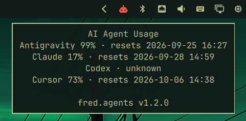
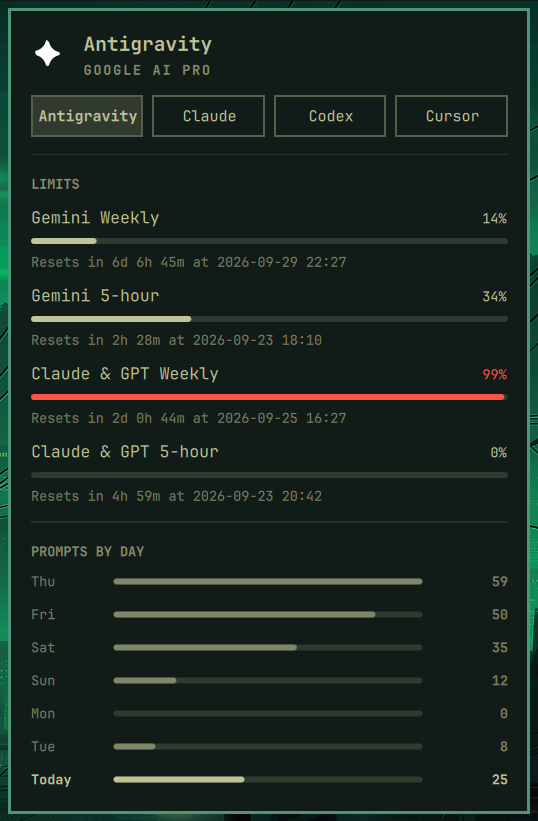

# Agents Token Usage Reporter (`fred.agents`)

Part of Fred's `fred.*` plugin suite for [Tamlinux](https://github.com/greenermoose/tamlinux) (Fred's personal Linux workstation environment): a shell bar widget tracking usage and token spend for **Antigravity, Claude, Codex, and Cursor**. It runs in the Tamlinux shell.

The 2.x line ships with Tamlinux. The historical Omarchy 1.x line had its first tagged release at 1.1.2.





## Installation

The 2.x plugin is included in the pinned [Tamlinux package assembly](https://github.com/greenermoose/tamlinux-packages). Its installed payload is at `~/.config/tamlinux/plugins/fred.agents/`; install and update it with the assembly through Home Manager. The standalone repository contains the frozen Omarchy 1.x line.

Place `{ "id": "fred.agents" }` in a `left`, `center`, or `right` list under `layout` in `~/.config/tamlinux/shell/layout.json`. The document uses `schemaVersion: 1`. Widget settings are the `fred.agents` entry under `entries` in `~/.config/tamlinux/shell/settings.json`, whose top-level `version` is `1`.

See [plugin ownership](../README.md) and the [deployment contract](https://github.com/greenermoose/tamlinux-packages/blob/main/docs/deployment.md). Home and XDG paths below use their default locations; the helpers honor the corresponding `XDG_*_HOME` overrides.

## Panel

- **Hero** — the mark, the tool, and the plan it runs on.
  Auth and endpoint problems replace the plan line and repeat in a card.
- **Subscription switch** — one chip per enabled agent (`h`/`l` or click).
  It appears only when more than one agent is enabled.
- **Limits** — the percentage of each allowance used, a matching meter, and
  the time until the session or weekly window resets. Claude and Codex report
  from their providers' own endpoints, and Cursor reports live plan usage from
  its dashboard endpoint — the included-total meter and the auto-model meter
  as separate rows (see Data); Antigravity has no remote usage read-out yet,
  so its section stays hidden.
- **Tokens by day** — one row per day for the last week: day, bar, tokens,
  with today bolded at the bottom. Hover today for its prompt and session
  count.
- **Tokens by model** — tokens per model with the bar behind each row scaled
  to the heaviest model. Hover for the input / output / cache split. Hidden
  for agents without a per-model breakdown.
- **Prompts by day** — Antigravity and Cursor have no local token usage, so
  their chart shows raw prompt counts per day instead of a token chart, with
  hover text giving the prompt and session count.

A subscription appears only when it is enabled in settings and has actually
recorded usage — on this machine or on a synced one. With one such agent
there is no switch row at all; with none, the module leaves the bar entirely
rather than sitting there with nothing to say. A CLI installed mid-session
shows up at the next refresh, so nothing polls the disk waiting for it.

## Data

Each agent is one JSON record in `~/.local/state/tamlinux/agents/usage/`,
written by the bundled `tam-agent-usage-update` that lives next to this
plugin's collectors. The widget invokes it on its refresh timer and whenever
you ask for a refresh, and picks up any record that lands in the directory
regardless of who wrote it.

The collectors are ported into this plugin; cache files use `$XDG_CACHE_HOME/tamlinux/agents`.

| Collector | Limits | Local stats |
|---|---|---|
| `claude` | Anthropic's OAuth usage endpoint (5-hour session + 7-day weekly) | `~/.claude/projects` transcripts, opencode sessions on an Anthropic provider, plus `stats-cache.json` and `history.jsonl` as fallback |
| `codex` | The Codex app-server RPC | native Codex CLI session files (plus pi and opencode sessions) |
| `antigravity` | — (unavailable) | `~/.gemini/antigravity-cli/history.jsonl` and `conversation_summaries.db`: prompt, session, and active-day counts |
| `cursor` | Cursor's dashboard RPC (`api2.cursor.sh` `DashboardService/GetCurrentPeriodUsage`): both the included-total and the auto-model percents of the monthly plan, each resets with the billing cycle | `~/.cursor/projects/*/agent-transcripts/*.jsonl` and `conversation-search.db`: prompt, session, and active-day counts |

Claude limits need a signed-in CLI; without credentials the panel says so and
falls back to local stats only. A non-default Claude directory is honored via
`CLAUDE_CONFIG_DIR`, Codex via `CODEX_HOME`.

Cursor's dashboard RPC is unofficial and may change: the collector reads the
sign-in token Cursor keeps in `state.vscdb` read-only, uses it only inside the
request's Authorization header, and never writes it anywhere — the record and
the limits cache carry only percentages and reset times.

## Interactions

- Bar icon: left = panel, right = launch agent, middle = next subscription.
- Panel: `h`/`l` switch subscription, `j`/`k` scroll, `r` or Enter refresh,
  Tab moves to the neighboring bar panel, Esc closes.
- IPC: `tam-shell fred.agents <open|close|toggle|refresh|next>`.

## Settings

Settings live under `entries["fred.agents"]` in `~/.config/tamlinux/shell/settings.json`:

| Key | Default | What it does |
|---|---|---|
| `refreshIntervalSec` | `900` | How often the usage records regenerate |
| `syncMode` | `"Off"` | `"On"` writes this machine's snapshot and merges the others |
| `syncDir` | `""` | A folder synced by Syncthing, Dropbox, rsync, … |
| `syncFileName` | `<hostname>.json` | This machine's snapshot file |
| `syncDeviceId` | hostname | Stable device name inside the snapshot |

Per-agent enablement is nested:

```json
{ "providers": {
  "claude": { "enabled": true },
  "codex": { "enabled": true },
  "antigravity": { "enabled": true },
  "cursor": { "enabled": true }
}}
```

`enabled` defaults to `true` for every discovered agent; set it to `false` to
hide a subscription that is installed. Disabled agents are also skipped when
the records regenerate.

With `syncMode` on, every `*.json` snapshot in `syncDir` is merged, so today,
the last 7 days, and the all-time totals cover every machine you code on —
active days are unioned by date rather than summed. Rate limits stay
per-account and are never merged. Prompt-only records declare
`"scope": "device"` and merge by summing exactly like token stats.

One caveat on "all-time": the Codex collector only reads native session files
touched in the last 30 days, so its totals and day counts cover that window.
Claude's cover every transcript still on disk.

## License

GNU General Public License v3.0 or later. See [LICENSE](LICENSE) for details.
Upstream Omarchy MIT copyright and diff recipe documented in
[UPSTREAM.md](UPSTREAM.md).
