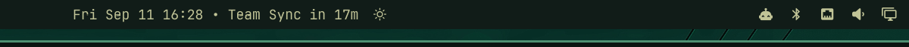

# Clock with Countdown Badge (`fred.clock`)

Part of Fred's `fred.*` plugin suite for [Tamlinux](https://github.com/greenermoose/tamlinux) (Fred's personal Linux workstation environment): a shell bar widget featuring upcoming event countdowns, multi-calendar support, in the Tamlinux shell.



---

## Overview

`fred.clock` is the Tamlinux clock widget, with upcoming event countdown badges and a rich read-only interactive agenda:

| Feature | Description |
| :--- | :--- |
| **Tamlinux Integration** | Uses the shell's plugin host, shared panel and hover surfaces, and per-widget settings. |
| **Countdown Badge** | Displays upcoming events starting within 60 minutes directly on the bar (`HH:mm • Team Sync in 12m` or `Team Sync now`). |
| **Multi-Calendar Sync** | Fetches read-only schedules from Google Calendar or any iCalendar (`.ics`) secret URLs and local files with zero external dependencies. |
| **Interactive Agenda** | Selected day agenda list under the month grid with event times, color strips, meeting join buttons, and empty-state handling. |
| **Event Dots on Grid** | Up to 4 colored indicator dots on days with scheduled events matching calendar feed colors. |
| **Account Filter Chips** | Quick multi-account filtering (e.g. `All`, `Work`, `Personal`, `Projects`) directly in the agenda. |
| **1-Click Meeting Join** | Automatically detects Google Meet, Zoom, Teams, and Webex links with safe, non-blocking `xdg-open` launches. |
| **Markdown Copy** | Copy the selected day's complete agenda as structured Markdown (`y` hotkey or toolbar button). |
| **Local Event Management** | Create, view, and delete local events directly in the agenda UI or via CLI without external calendar dependencies. Stored in standard RFC 5545 `.ics` format. |

---

## Features

- **Next-Event Countdown**: When an event is within 60 minutes (configurable via `badgeMinutes`), the bar widget displays the event title and time remaining.
- **Rich Interactive Agenda**: Selecting any day in the month grid reveals its scheduled agenda cards, times, accounts, and meeting links.
- **Local Event Management**: Add and delete local events with title, date, time/all-day, and location directly in the UI or via CLI. Events persist in `~/.config/tamlinux/clock/local.ics` and instantly hot-reload reactively.
- **Privacy-First & Read-Only Feeds**: Consumes remote `.ics` subscription URLs via standard HTTP GET. No OAuth tokens, no write permissions, no risk of unwanted invite dispatches.
- **Zero Daemon Dependencies**: Uses Python 3 standard library only (`ThreadPoolExecutor`, `urllib`, `zoneinfo`) for background fetching without extra background daemons.
- **Robust Recurrence & Timezones**: Supports standard RFC 5545 recurrence rules (`RRULE`), exclusions (`EXDATE`), all-day events, and wall-clock time preservation across daylight saving transitions (DST).
- **Non-Blocking Quickshell Integration**: Events are cached atomically at `~/.cache/tamlinux/clock/events.json` (mode 0600) and watched reactively by Quickshell.

---

## Installation

The 2.x plugin is included in the pinned [Tamlinux package assembly](https://github.com/greenermoose/tamlinux-packages). Its installed payload is at `~/.config/tamlinux/plugins/fred.clock/`; install and update it with the assembly through Home Manager. The standalone repository contains the frozen Omarchy 1.x line.

Place `{ "id": "fred.clock" }` in a `left`, `center`, or `right` list under `layout` in `~/.config/tamlinux/shell/layout.json`. The document uses `schemaVersion: 1`. Widget settings are the `fred.clock` entry under `entries` in `~/.config/tamlinux/shell/settings.json`, whose top-level `version` is `1`.

See [plugin ownership](../README.md) and the [deployment contract](https://github.com/greenermoose/tamlinux-packages/blob/main/docs/deployment.md). Home and XDG paths below use their default locations; the helpers honor the corresponding `XDG_*_HOME` overrides.

## Configuration

### Calendar Feeds

Configure your calendars in `~/.config/tamlinux/clock/calendars.json` (permissions `0600`):

```json
[
  {
    "account": "Personal",
    "name": "Personal Calendar",
    "url": "https://calendar.google.com/calendar/ical/your-address%40gmail.com/private-xxxx/basic.ics",
    "color": "#4285f4",
    "enabled": true
  },
  {
    "account": "Family",
    "name": "Family Events",
    "url": "https://calendar.google.com/calendar/ical/your-group%40group.calendar.google.com/private-yyyy/basic.ics",
    "color": "#34a853",
    "enabled": true
  },
  {
    "account": "Local",
    "name": "Local Events",
    "path": "~/Documents/calendar.ics",
    "color": "#fbbc05",
    "enabled": false
  }
]
```

#### Finding Your Google Calendar Secret URL

1. In [Google Calendar](https://calendar.google.com), click the **⚙️ Settings** icon in the upper right.
2. In the left sidebar under **Settings for my calendars**, click the calendar you wish to sync.
3. Scroll down to the **Integrate calendar** section.
4. Copy the **"Secret address in iCal format"** URL (*not* the public address).
5. Paste the copied URL into the `"url"` field of your `calendars.json`.

#### Feed Properties

| Property | Type | Description |
| :--- | :--- | :--- |
| `account` | string | Category label shown on event cards and used for agenda filter chips (e.g. `Personal`, `Work`). |
| `name` | string | Descriptive calendar name (e.g. `Primary`, `Family`). |
| `url` | string | Secret `.ics` HTTP/HTTPS subscription URL. |
| `path` | string | Absolute or home-relative path to a local `.ics` file (alternative to `url`). |
| `color` | string | Hex color code (e.g. `"#4285f4"`) for grid dots and event card strips. |
| `enabled` | boolean | Set to `false` to temporarily skip fetching this feed without removing it. |

### Automatic Synchronization

Events are pulled and cached automatically in the background—**no terminal commands or daemon setups are required**:

- **Instant on Save**: The bar widget watches `~/.config/tamlinux/clock/calendars.json`. The moment you save changes to your feeds, an immediate background fetch is triggered.
- **Periodic Background Sync**: Automatically checks and refreshes all enabled feeds every 15 minutes.
- **On Panel Open**: Opening the calendar panel checks cache freshness and refreshes events if older than 5 minutes.
- **Shell Startup**: Fetches automatically whenever your desktop session initializes.
- **Manual (Optional)**: If you ever want to force a refresh from the terminal: `python3 ~/.config/tamlinux/plugins/fred.clock/fetch-events.py`


### Managing Local Events

You can create and manage private local calendar events without external Google Calendar dependencies. Events are stored in standard RFC 5545 format at `~/.config/tamlinux/clock/local.ics` (permissions `0600`) and automatically registered under the `"Local"` account.

#### From the User Interface
- Click the **`+`** button in the agenda header or press **`n`** / **`a`** while the panel is open.
- Enter the event title, choose all-day or specify start/end times (e.g. `14:00` – `15:30`), optionally enter a location, and click **Save Event** (or press Enter).
- To delete a local event, click the trash can icon (**`󰆴`**) on any local event card.

#### From the Command Line
```bash
# Add an all-day local event
python3 ~/.config/tamlinux/plugins/fred.clock/manage-event.py add --date 2026-09-15 --summary "Doctor's Appointment" --all-day

# Add a timed local event with location
python3 ~/.config/tamlinux/plugins/fred.clock/manage-event.py add --date 2026-09-15 --start-time 14:00 --end-time 15:30 --summary "Design Review" --location "Office 3B"

# Delete a local event by UID
python3 ~/.config/tamlinux/plugins/fred.clock/manage-event.py delete --uid "<event-uid>"

```

### Bar Settings

Widget settings in the `fred.clock` entry of `~/.config/tamlinux/shell/settings.json`:

- `format`: Clock date/time format string (default: `"ddd MMM d HH:mm"`).
- `formatAlt`: Alternative date/time format string (default: `"d MMMM 'W'ww yyyy"`).
- `verticalFormat`: Format string when the bar is vertical (default: `"HH\n—\nmm"`).
- `badgeMinutes`: Maximum minutes ahead to show upcoming event countdown badges (default: `60`, set to `0` to disable).

---

## Interactions & Shortcuts

### Bar
- **Left Click**: Open / close the calendar and agenda panel.
- **Right Click**: Cycle through configured date and time formats.
- **Middle Click**: Open the Tamlinux timezone switcher (`tam-menu-timezone`).

### Agenda Panel
- **Click Day Cell**: Select that date and display its agenda.
- **`n` / `N` / `a` / `A`** (or `+` button): Open the inline "New Local Event" creator.
- **Trash Button (`󰆴`)**: Delete a local event from its agenda card.
- **`y` / `Y`** (or copy button): Copy the selected day's agenda as Markdown to clipboard.
- **`t` / `T`** (or hero date click): Return to today.
- **`[` / `]`** (or chevrons / mouse wheel): Previous / next month.
- **`{` / `}`**: Previous / next year.
- **`w` / `W`** (or "W" heading click): Toggle week start day (Sunday vs. Monday).
- **Escape**: Close the inline add event form (if open) or close the panel.

---

## Security Model

`fred.clock` runs inside the Quickshell desktop shell environment. All process executions, network interactions, and filesystem writes adhere to a strict least-privilege security model designed to resist malicious feeds, unbounded resource consumption, and ambient environment leakage.

### Supervised Process Execution

Nothing in the plugin invokes ambient shells (`bash`), unconstrained execution (`execDetached`), or nested child processes. Every process is spawned through a dedicated `Launch.qml` supervisor with an absolute executable path, a closed environment constructed from a minimal allowlist (`clearEnvironment: true`), and an automated watchdog timer that sends `SIGTERM` followed by `SIGKILL`:

| Process | Trigger | Executable | Environment Allowlist | Deadline / Watchdog |
| :--- | :--- | :--- | :--- | :--- |
| **Event Fetcher** | Session start, 15m timer, panel open if stale (>5m), config change | `/usr/bin/python3` (`fetch-events.py`) | `HOME`, `TZ`, `LANG`, `XDG_CONFIG_HOME`, `XDG_CACHE_HOME` | 60s QML watchdog (SIGTERM + SIGKILL after 3s); 45s self-imposed `signal.alarm` |
| **Event Manager** | Add / delete local event in UI | `/usr/bin/python3` (`manage-event.py`) | `HOME`, `TZ`, `LANG`, `XDG_CONFIG_HOME`, `XDG_CACHE_HOME` | 20s QML watchdog |
| **Meeting URL Opener** | Click "Join Meeting" button in agenda | `/usr/bin/xdg-open` | `HOME`, `LANG`, `XDG_RUNTIME_DIR`, `WAYLAND_DISPLAY`, `DISPLAY`, `DBUS_SESSION_BUS_ADDRESS`, `XDG_CURRENT_DESKTOP`, `XDG_SESSION_TYPE`, `XDG_DATA_HOME`, `XDG_DATA_DIRS`, `XDG_CONFIG_HOME`, `XDG_CONFIG_DIRS`, `HYPRLAND_INSTANCE_SIGNATURE` | 10s QML watchdog |
| **Clipboard Copy** | Press `y` or click agenda copy button | `/usr/bin/wl-copy` | `XDG_RUNTIME_DIR`, `WAYLAND_DISPLAY` | 10s QML watchdog (text piped directly to stdin) |
| **Desktop Notifications** | Event added/deleted, agenda copied, or calendar busy | `tam-notification-send` through `TAMLINUX_BIN` (default `~/.local/bin`) | `HOME`, `XDG_RUNTIME_DIR`, `WAYLAND_DISPLAY`, `DBUS_SESSION_BUS_ADDRESS` | 10s QML watchdog |

#### Component-Relative Helper Resolution
The bundled plugin payload is immutable in the Nix store; user configuration, state and cache live separately. Helper scripts (`fetch-events.py`, `manage-event.py`) are never resolved by guessing hard-coded paths; instead, they are dynamically resolved as sibling paths of the loaded QML component via `Model.helperPath(Qt.resolvedUrl(...))`.

### Resource Bounds and Aggregation Limits

To prevent memory exhaustion, slow-drip HTTP attacks, or calendar recurrence bombs, `fetch-events.py` operates under strict resource limits and self-supervision:

| Constant | Value | Rationale |
| :-- | :-- | :-- |
| `MAX_CONFIG_BYTES` | 64 KiB | dozens of feeds is already generous |
| `MAX_FEEDS` | 32 | thread pool is 8; 32 keeps a run under the deadline |
| `MAX_FEED_BYTES` | 8 MiB | a busy multi-year Google calendar is 1–3 MiB |
| `FEED_DEADLINE_S` | 20 s | socket timeout stays 10 s; this bounds slow-drip bodies |
| `MAX_LINE_BYTES` | 64 KiB | RFC 5545 folds at 75 octets; 64 KiB tolerates sloppy exporters |
| `MAX_LINES` | 200 000 | ~8 MiB at typical line lengths |
| `MAX_VEVENTS_PER_FEED` | 20 000 | |
| `MAX_EXDATES` | 2 000 per event | |
| `MAX_INSTANCES_PER_EVENT` | 1 000 iterations | window is 31 days; daily = 31, hourly is not supported |
| `INTERVAL` / `COUNT` clamp | `[1, 366]` / `[1, 10 000]` | |
| `MAX_SUMMARY` / `MAX_LOCATION` / `MAX_DESCRIPTION` | 512 / 2 048 / 4 096 chars | description feeds only the agenda tooltip and meeting-URL regex |
| `MAX_EVENTS_TOTAL` | 5 000 | agenda shows one day at a time |
| `MAX_OUTPUT_BYTES` | 4 MiB | `FileView` loads it into the shell's heap on every change |
| `DEADLINE_S` (`signal.alarm`) | 45 s | inside the QML 60 s watchdog |
| `RLIMIT_CPU` / `RLIMIT_AS` / `RLIMIT_FSIZE` / `RLIMIT_NOFILE` | 30 s / 512 MiB / 16 MiB / 64 | |
| QML deadlines | fetch 60 s, manage 20 s, others 10 s | TERM, then KILL after 3 s |

### Cache Directory Contract & Atomic Writes

All cache and configuration file writes go through `write_private_file`:
- **Directory Validation**: The target directory (`~/.cache/tamlinux/clock` or `~/.config/tamlinux/clock`) must be a private, self-owned directory (`st_uid == getuid()`, mode `0700`, no group/other write permissions). Parent directories must not be group/other-writable unless the sticky bit is set.
- **Descriptor-Relative & No-Follow**: The directory is opened once with `O_DIRECTORY | O_NOFOLLOW`. Temporary files are created relative to this directory descriptor (`dir_fd`) using `O_CREAT | O_EXCL | O_NOFOLLOW | O_CLOEXEC` with permissions `0600`.
- **Atomic Replace**: Files are replaced via `renameat` relative to the directory descriptor, ensuring symlinks are never followed or clobbered. Any failure unlinks the temporary file before raising an error.

### Refusal Behavior
The plugin enforces a strict "refuse, don't repair" contract:
- Insecure feed URLs (e.g. `http://` or cross-scheme redirects to HTTP) are rejected, leaving legitimate feeds operational.
- Oversized feeds or feeds exceeding deadlines are dropped with a stderr notice.
- If the cache directory fails ownership or permission checks, the fetcher exits with code 1 immediately without modifying existing files.
- Local event mutations (`manage-event.py`) validate all parameters before touching any file and reject invalid input with exit code 2.

---

## Removing the widget

Remove its ID from the Tamlinux layout. To omit its installed payload, set `tamlinux.shell.plugins` to the IDs to retain and activate the matching Home Manager configuration. Saved settings and data remain available for re-enabling it.

## Acknowledgments

Developed with the assistance of [Antigravity](https://antigravity.google) (Google DeepMind), which contributed to the multi-calendar sync architecture, upcoming event countdown badge, and interactive agenda panel.

---

## License

GNU General Public License v3.0 or later. See [LICENSE](LICENSE) for details.
Upstream Omarchy MIT copyright and diff recipe documented in [UPSTREAM.md](UPSTREAM.md).
